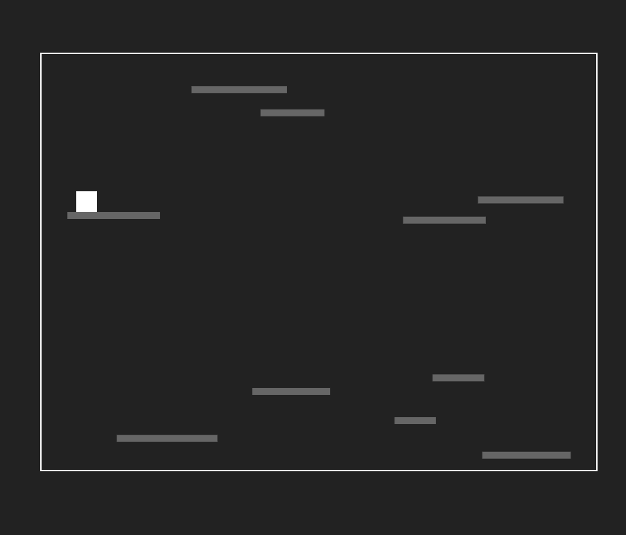

# Canvas

Read.me (Canvas):

O projeto do jogo é baseado em jogos de fuga em 2d
Quando o jogo é iniciado, o personagem aparece em uma plataforma e tenta fugir dela passando por alguns obstáculos (outras plataformas)
Quando o personagem chega na saída, o jogo encerra.

HTML: 
Fizemos a estrutura básica e identificamos o id do nosso Canvas

Css: 
Estilizamos/personalizamos o nosso jogo.
Colocamos margem e cores

Javascript:

Fizemos plataformas, porta e obstáculos utilizando o Canvas.

Uploading WhatsApp Video 2023-09-19 at 10.46.13.mp4…

